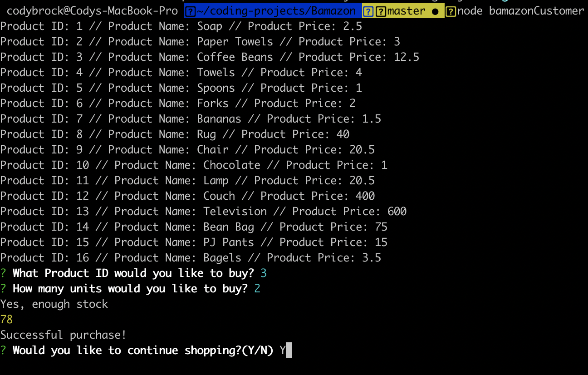
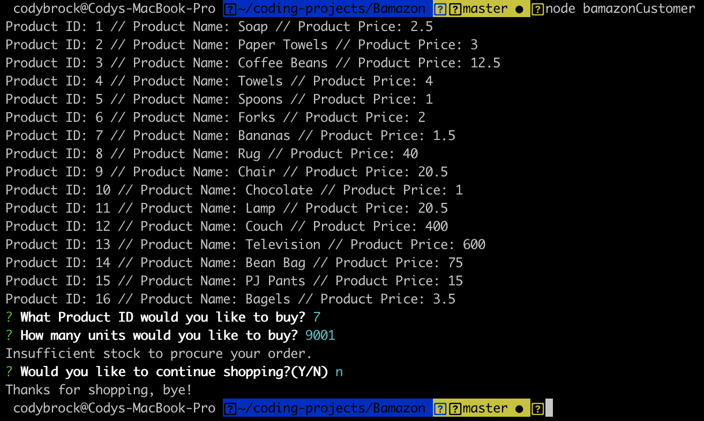
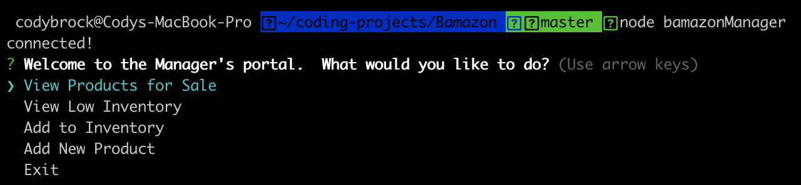
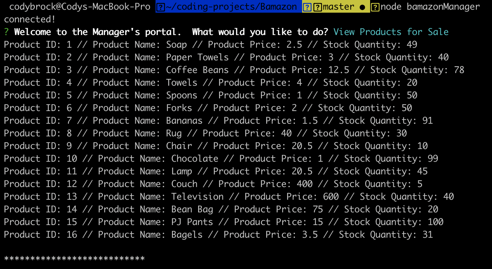
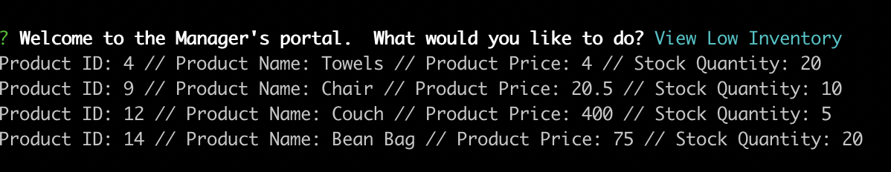
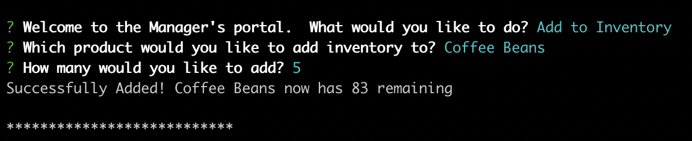
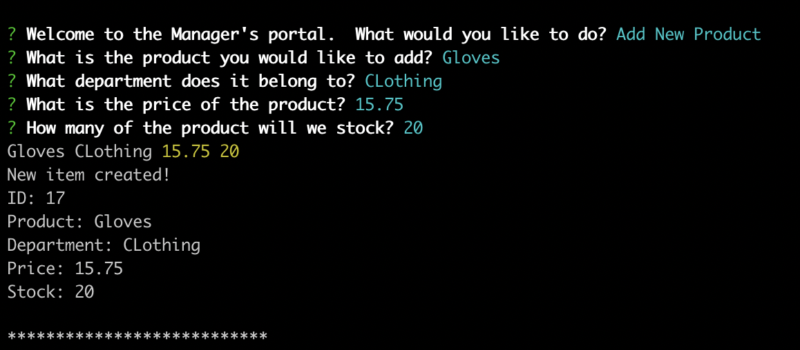
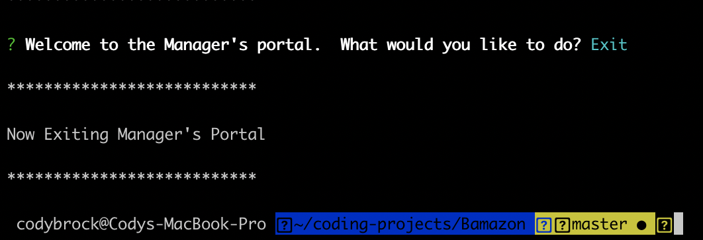

# Project Title

Bamazon is a CLI app that uses Node and mySQL to model a basic online marketplace.  Two different user types are supported: customers can view and purchase from inventory, while managers can track low inventory and add new items to the inventory.

## Getting Started

These instructions will get you a copy of the project up and running on your local machine.

### Prerequisites

In order to get this project running on your local, you will need:
* mySQL
* Node.js
* A GitHub account
* Terminal


### Installing

Clone the repo to your machine.  From your terminal, navigate to the root of the folder and run an npm install to get the Inquirer and mySQL packages:

```
npm i
```

Pull up your mySQL workbench and use the script in the "bamazon.sql" file to get your database and table set up.

### How to Use

Once your packages are installed and your database is ready, you should be ready to use Bamazon.  There are two different "views" available to the user: **customer** and **manager**.

#### Customer
To get the Customer view, run:
```
node bamazonCustomer
```
The products are automatically listed, showing their ID, name, and price.  The customer is then prompted for the ID of the product they would like to buy, then the number of units.

If there is insufficient stock or the selection is invalid, the transaction ends and the customer can choose to continue shopping or exit.  If there is enough stock, the purchase is confirmed, the database is updated, and the customer is prompted to continue shopping or exit.  

#### Manager
To get the Manager view, run:
```
node bamazonManager
```
The manager's portal has more options and privileges than the customer.  The manager can choose from the following commands:

| Command | Description |
| --- | --- |
| View Products for Sale  | Shows all products like the customer view, but also displays the stock quantity |
| View Low Inventory  | Displays only products where stock quantity is less than 30 units |
| Add to Inventory  | Allows manager to select a product, then indicate how many units to add to the stock quantity |
| Add New Product   | Allows manager to add a new product to the inventory.  The manager gives the name of the product, the department it belongs to, the price, and the stock quantity.  Then, the database is updated with this new product's information |


## Screenshots of the App Functioning
* Customer: Successful purchase:



* Customer: Unsuccessful purchase:



****************************************************

* Manager: Options



* Manager: View Products for Sale



* Manager: View Low Inventory:



* Manager: Add to Inventory:



* Manager: Add New Product:



* Manager: Exit Portal:




## Author

* **Cody Brock** - *Full project* - [github](https://github.com/cody-brock)


## License

This project is licensed under the MIT License - see the [LICENSE.md](LICENSE.md) file for details

## Acknowledgments

* Thank you to amazon for the inspiration
